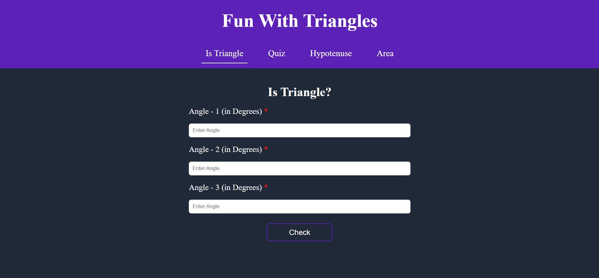
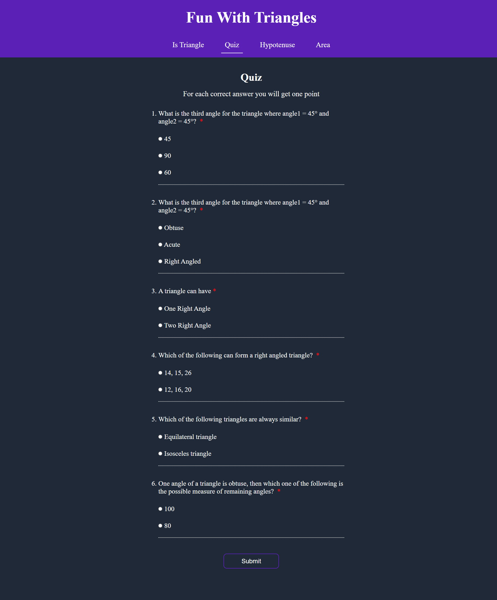
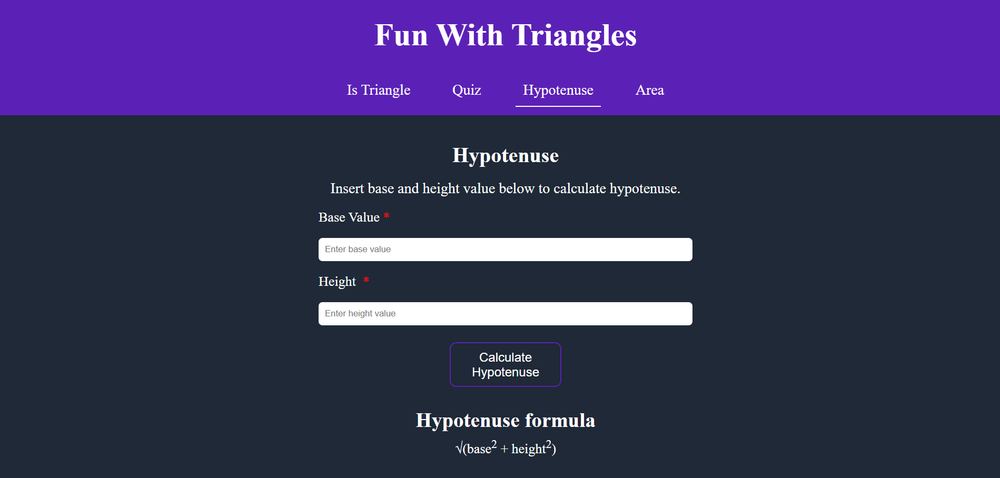
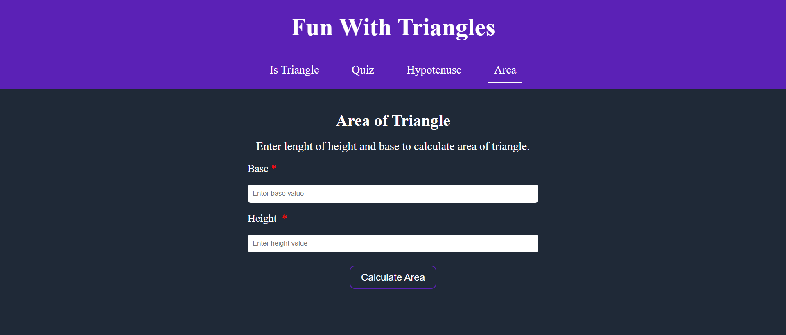

# neoG Camp - Fun With Triangles

Calculate area, the hypotenuse of the triangle, play a quiz based on the triangle and give three angles to decide if they form a triangle.

## Table of contents

- [Overview](#overview)
  - [Screenshot](#screenshot)
  - [Links](#links)
- [My process](#my-process)
  - [Built with](#built-with)
  - [What I learned](#what-i-learned)
- [Author](#author)

## Overview

### Screenshot









### Links

- [View live](https://funwithtriangles12.netlify.app/area.html)

## My process

### Built with

- Semantic HTML5 markup
- [Sass](https://sass-lang.com/) - CSS extension language
- CSS Flexbox
- Vanilla JavaScript

### What I learned

Fun With triangles is multipage website. I learned multiple things in this project.

1. `Node.insertBefore()`

The `Node.insertBefore()` insert a node before a reference node having the same parent element.

Syntax

```js
parentNode.insertBefore(nodeToInsert, refernceNode);
```

2. I learned to set attribute using JavaScript using `setAttribute()` method

Syntax

```js
element.setAttribute("attributeName", "attributeValue");
```

3. For the first time I worked with FormData API. In the quiz section of project, I used FormData API to evaluate the answers submitted by the user.

Example from Code

```js
let formData = new FormData(quizForm);
let index = 0;

for (let value of formData) {
  if (answers[index] == value[1]) {
    score++;
  }
  index++;
}
```

## Author

- Twitter - [@junaidshaikh_js](https://twitter.com/junaidshaikh_js)
- Linkedin - [@junaidshaikhjs](https://www.linkedin.com/in/junaidshaikhjs/)
